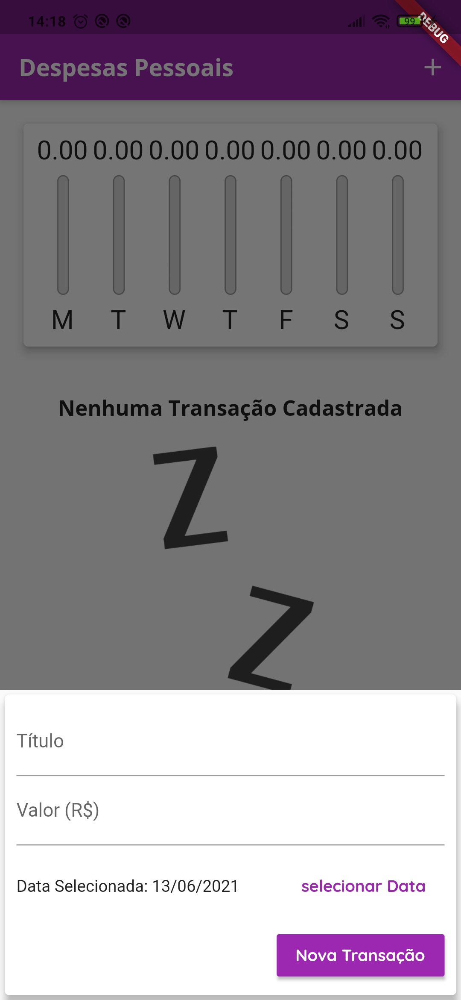
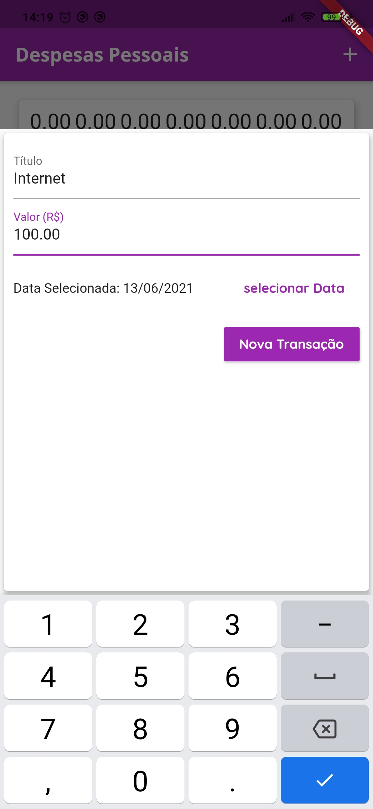
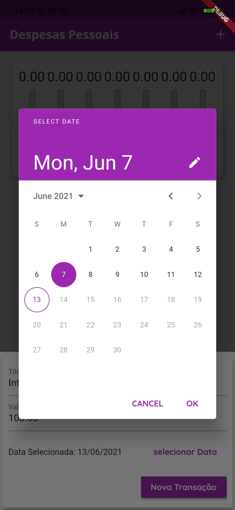
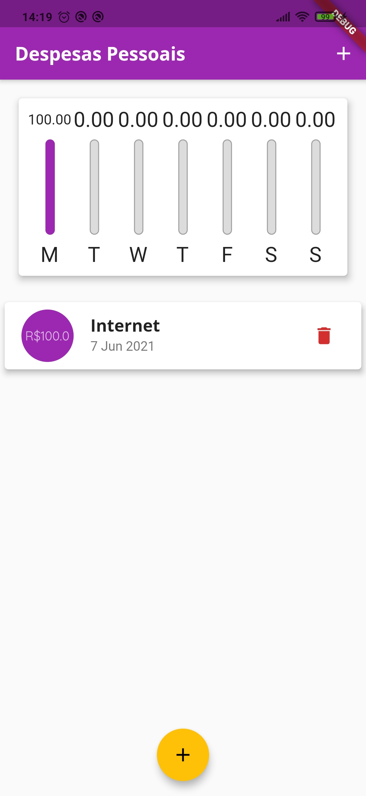
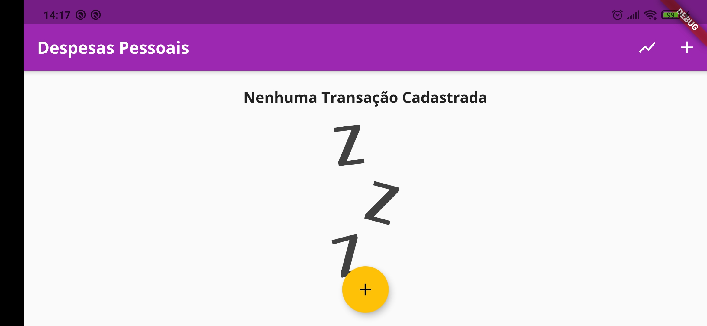
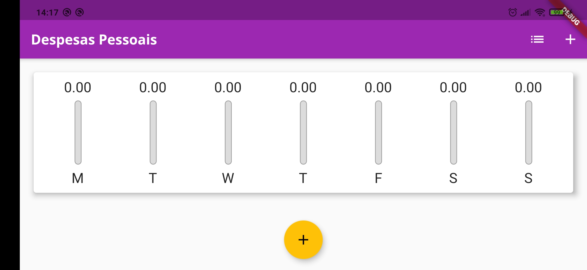
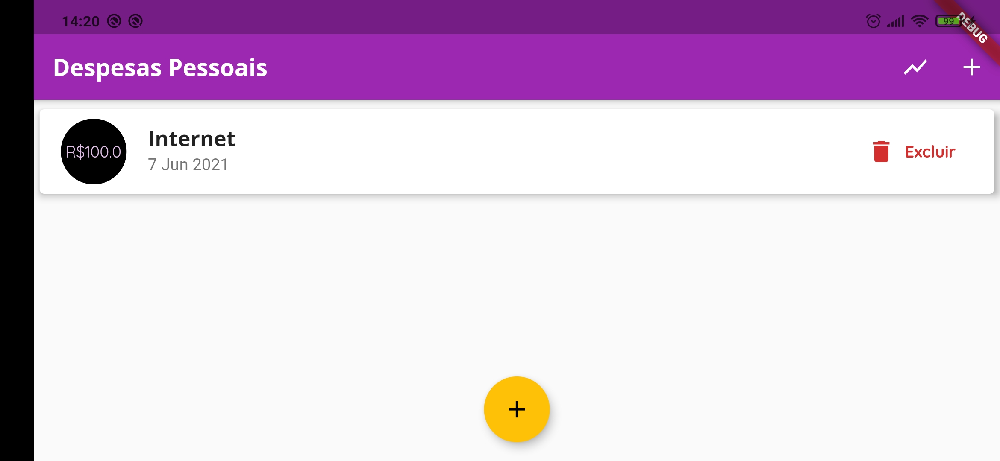
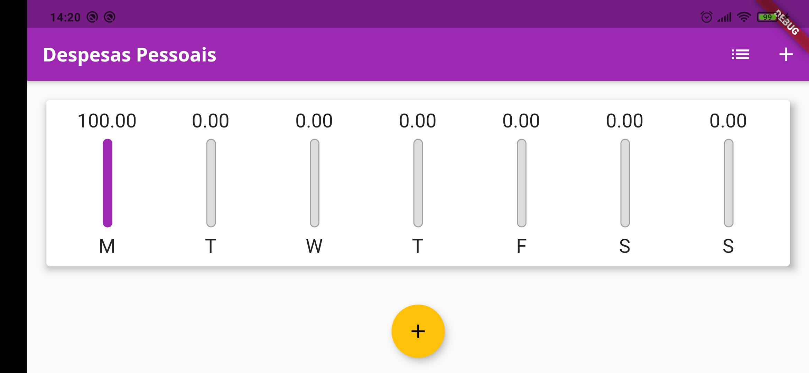

# Expenses


Tabela de conteúdos
=================
<!--ts-->
   * [Sobre o projeto](#-sobre-o-projeto)
   * [Layout](#-layout)
   * [Como executar o projeto](#-como-executar-o-projeto)
     * [Pré-requisitos](#pré-requisitos)
     * [Rodando o Aplicativo](#-rodando-o-aplicativo)
   * [Tecnologias](#-tecnologias)
<!--te-->


## 💻 Sobre o projeto

Expenses é um app para organizar gastos no decorrer de uma semana. Para utilizar basta o usuário informar um título, o valor e a data do gasto, após isso um novo item com o gasto será gerado na lista e o seu valor será adicionado no chart de barra. O app apresenta layout reponsivo e uso de fontes de texto customizadas. 


---

## 🎨 Layout

Demonstração do uso do App

-Modo retrato:
<p align="center">
  
  
  
  
  
</p>
-Modo paisagem:
<p align="center">
  
  
  
  
</p>


---

## 🚀 Como executar o projeto
Abaixo são apresentados os passos necessários para que o App funcione.

### Pré-requisitos

Antes de começar, você vai precisar ter instalado em sua máquina as seguintes ferramentas:
[Git](https://git-scm.com), [Flutter](https://flutter.dev/docs/get-started/install). 
Além disto é bom ter um editor para trabalhar com o código como [VSCode](https://code.visualstudio.com/)

#### 🎲 Rodando o Aplicativo

```bash

# Clone este repositório
$ git clone https://github.com/willyoliv/projeto_perguntas.git

# Acesse a pasta do projeto no terminal/cmd
$ cd bytebank

# Instale as dependências
$ flutter pub get

# Execute a aplicação 
$ flutter run


```

---

## 🛠 Tecnologias

As seguintes ferramentas foram usadas na construção do projeto:

- [Flutter](https://flutter.dev/)


